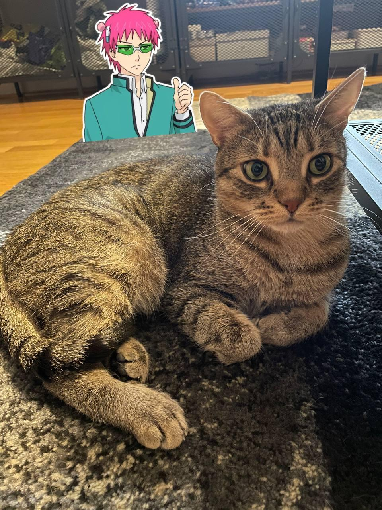

```{r setup, include=FALSE}
knitr::opts_chunk$set(echo = TRUE)
library(lme4)
library(viridis)
library(hrbrthemes)
library (dplyr)
library (readr)
library(tidyverse)
library(ggridges)
library(performance)
library(qqplotr)
library(see)
```

[MyAnimeList](https://myanimelist.net/) is a website similar to IMDB. 
Here the user finds synopses of anime movies and series, related characters, the number of episodes, the source (whether it's an original anime or it's a manga adaptation), the genre and many more. 
The users can create a list from the anime listed on this website, they can mark their favorites and also rate the anime on a scale from 1 to 10. 

My cat, Maci is always happy to watch anime with me. 
One might think he's lazy since he's sleeping most of the time, but at night, he works on a secret project: he wants to create an anime. 
Since he likes to study with me (well, he is sleeping next to me most of the time), he knows it's worth to analyze some data if he wants his project to be a huge success. 

I found his work hidden under the bed, you can find it below, copied and pasted, without any changes. 
The comments are made by me, just to be sure you can understand what he had been doing.

## Acquire data ## 
```{r download-anime-data}
file_path="anime_data.csv"
# Avoid downloading anime data every time
if (!file.exists(file_path)) {
  # Take slow internet connection into account, as the data is quite large
  options(timeout = 5*60)
  github_url="https://raw.githubusercontent.com/rfordatascience/tidytuesday/master/data/2019/2019-04-23/tidy_anime.csv"
  download.file(github_url, file_path)
} 
```

```{r parse-anime-data}
anime_data = read_csv(file_path,show_col_types = FALSE)
#We need every anime only once for several calculations
anime_data_distinct_by_name = anime_data %>% distinct(name, .keep_all = TRUE)
summary(spec(anime_data))
glimpse(anime_data)
```

## First analysis ## 

Maci wanted to check whether the users' interaction with the anime on the website (especially the number of the votes) positively influences the score of the anime or not. According to his opinion, more interaction does not mean higher scores - something being awfully bad can urge people to voice their opinion. 
What a smart cat! I wish he would have this level of enthusiasm when it comes to pay rent (which he never does, obviously.)

He made a multiple regression model to analyze his question. 
The outcome variable was the score of all the anime on MyAnimeList.
He wanted to see how the number of people scoring an anime affects its overall score, but also considered the number of favorites that might add significantly to the outcome.

So the predictors were:

* Favorites (how many users marked an anime as their favorite)
* Scored_by (how many users scored an anime)

**The sample size was N=13628**

```{r}
#We need positive numbers as predictors for log function.
anime_data_with_positive_scores_favorites_scored_by= anime_data_distinct_by_name %>% 
  filter(
    !is.na(score),
    score>0,
    !is.na(favorites),
    favorites>0, 
    !is.na(scored_by),
    scored_by>0)
score_by_favourites_and_scored_by_lm = lm(score ~ log(favorites) + log(scored_by), anime_data_with_positive_scores_favorites_scored_by)
```

### Assumptions testing ###

```{r}
check_model(score_by_favourites_and_scored_by_lm,check="linearity")
```

> Maci had to transform the predictors, since the assumption of linearity was problematic with the original data.
After the logarithmic transformation, the assumption of linearity seems acceptable.

```{r}
check_model(score_by_favourites_and_scored_by_lm,check="homogeneity")
```

> According to the plot, there might be a problem with the assumption of homoskedasticity, 
since the reference line is not perfectly flat and horizontal.


```{r}
check_model(score_by_favourites_and_scored_by_lm,check="vif")
```

> In the original model (the one with 3 predictors) the assumption of multicollinearity was violated,
the VIF value of the Members and the Scored by variable was above 10. So the members variable was removed.
According to the plot, the VIF statistics are not causing issues now, since they are all smaller than 5.

```{r}
check_model(score_by_favourites_and_scored_by_lm,check="outliers")
```

> According to the plot, there are no relevant outliers in the dataset.
```{r}
check_model(score_by_favourites_and_scored_by_lm,check=c("qq","normality"))
```

> According to the plot, the assumption of the normality of residuals might be violated.
  On the first plot, the residuals are far from fitting the reference line.
  THe second plot shows, that our data is slightly left skewed, and also leptokurtic.
  The solution to this issue could be bootstrapping or applying stricter criteria for significance levels
  (accepting significance levels below .01, instead of .05).

```{r}
summary(score_by_favourites_and_scored_by_lm)
```
### Regression analysis ###
The F test indicates that our model provides a better fit than the baseline model (F(2,8394)= 3419, p<0.001).
According to the analysis, 44,9% of the dependent variable (Overall scores of anime) can be explained by the independent variables (Adj.R^2=0.449).

### The predictors ###
There is is 0.002 point increase inthe score of an anime on MyAnimeList for each extra 1% member marking it as their favorite (t=33.59, ß=0.2, p<0.001)
One percent increase in the members scoring an anime would result a 0.00047 point increase in the overall score of the anime (t=7.54, ß0.047, p<0.001).

**So, the number of members scoring an anime on MyAnimeList has a significant positive (but only a minor) effect on the overall score on the anime, after controlling the number of the members interacting with the product in other ways (such as marking it as their favorite)**

## Second analysis ##

There are usually two types of anime: the ones being an adaptation of a manga (which is a type of comic),
and original ones (which were originally made as an anime). Anime can be also sorted by the age group they have been made for.
For example, if the anime contains violence, the rating is usually R17+, but there is also a category named PG13,
with the anime made for 13+ years old, and PG for children below 13 years old.

Maci wanted to know whether manga based anime score better, than the original ones. 
He also wanted to analyze if it's worth to make an R17+ rated product, or he should stick to the PG 13.
He built another multiple regression model.
The outcome variable was the overall score of anime.

The predictors were:

* the source of the anime (1: Manga, 2: Original).
* the rating of the anime (1:PG13, 2: R17+)

**The sample size was N=3303**

```{r}
manga_based_and_original_anime = filter(anime_data_distinct_by_name, 
                                        source %in% c("Manga","Original"),
                                        rating %in% c("R - 17+ (violence & profanity)","PG-13 - Teens 13 or older")) 

score_by_source_and_rating_lm = lm(score ~ source + rating, data = manga_based_and_original_anime)

```

### Assumptions testing ###
```{r}
check_model(score_by_source_and_rating_lm,check="linearity")
```

> Since the variables in the analysis are both binary, dummy variables, there is no need to evaluate this assumption (they meet it by definition).

```{r}
check_model(score_by_source_and_rating_lm,check="homogeneity")
```

> Since the variables in the analysis are both binary, dummy variables, the assumption is met.

```{r}
check_model(score_by_source_and_rating_lm,check="vif")
```

> The VIF statistics are smaller than 5, so the assumption was met.

```{r}
check_model(score_by_source_and_rating_lm,check="outliers")
```

> According to the plot, there are relevant outliers in the dataset.
> Since the sample size is large (N=3303), this might not be a relevant issue.

```{r}
check_model(score_by_source_and_rating_lm,check=c("qq","normality"))
```

> According to the plot, the assumption of the normality of residuals might be violated.
  On the first plot, the residuals are far from fitting the reference line.
  THe second plot shows, that our data is slightly left skewed, and also leptokurtic.
  The solution to this issue could be bootstrapping or applying stricter criteria for significance levels
  (accepting significance levels below .01, instead of .05).

```{r}
summary(score_by_source_and_rating_lm)
```

### Regression analysis ###
The F test indicates that our model provides a better fit than the baseline model (F(2, 3291)= 157.5, p<0.001).
According to the analysis, 8% of the dependent variable (Overall scores of anime) can be explained by the independent variables (Adj.R^2=0.86).

### The predictors ###
If an anime is an original one, its score is 0.56 less than a manga adaptation (t=-17.639, ß=-0.56, p<0.0.001).
The rating of anime was not significant (t=1.503, ß=0.06, p=0.133).

**So, it would be more beneficial for Maci to choose a manga and adapt it to anime, rather than creating an original story.**

## Third analysis ##

Maci wanted to analyze the most frequent genres as well.
He listed the top 10 genres, and wanted to see the distribution of scores by genre.
It could help him to narrow down the choice of the genre of his anime.
He used a plot to take a look at this question.
The plot shows the frequency of the genres (how many anime was created in the genre) in decreasing order.

As we see on the chart, the greatest % of the scores are between around 6 and 7.5.
If Maci aims to create something unique, breaking out in the sci-fi genre would be the easiest
since there are not many high scored entries in sci-fi.
However, if Maci wants to gather ideas from as many high scored anime as possible, supernatural and drama would be his best bet.

```{r}
anime_data %>% 
  filter(
    !is.na(score),
    !is.na(genre), 
    #These are not genres, but target demographics. 
    #Shounen is targeted towards male teenagers, Shoujo is its female counterpart.
    #Seinen is targeted towards adult men, Josei is its female counterpart.
    !(genre %in% c("Shounen","Shounen Ai","Shoujo Ai","Shoujo","Seinen","Josei"))
  ) %>% 
  mutate(genre = fct_reorder(genre, score)) %>% 
  mutate(genre = fct_lump(genre, n = 10)) %>%
  filter(!(genre %in% c("Other"))) %>% 
  ggplot() +
  aes(y = genre, x = score, fill = genre) +
  geom_density_ridges(show.legend = FALSE) +
  scale_fill_viridis_d(option = "plasma") +
  theme_ipsum() +
  theme(axis.line=element_blank(),
        panel.grid.major = element_blank(), 
        panel.grid.minor = element_blank(),
        panel.background = element_blank()) +
  labs(y = NULL,
       x = NULL,
       title = "Distribution of scores by genre")

```

## Fourth analysis ##

Maci wanted to see which genre was the most popular in the last few years, focusing on sci-fi, drama and supernatural - from the previous analysis.
The three genre are in decreasing order based on the number of anime in each genre. The colors indicate the mean score for every anime each year.

Supernatural and drama anime were exceptionally great during the last 5-10 years, while sci-fi follows a downward trend.
So this analysis emphasize the last one's finding: if Maci wants to create a unique anime, the best choice would be sci-fi, since there are not as many competition. 
Although, if he aims to ride the wave of currently popular anime, he's better off choosing supernatural or drama.

```{r}

anime_data %>% 
  filter(
    !is.na(score),
    !is.na(genre), 
    genre %in% c("Supernatural","Drama","Sci-Fi")
  ) %>% 
  mutate(year = as.integer(format(start_date, format="%Y"))) %>% 
  arrange(year) %>% 
  mutate(genre = fct_reorder(genre, score)) %>% 
  mutate(genre = fct_lump(genre, n = 10)) %>%
  filter(!(genre %in% c("Other"))) %>% 
  group_by(across(all_of(c('genre','year')))) %>% 
  summarize(score = mean(score))   %>% 
  ggplot() + 
  aes(y = genre, x = year, fill = score) +
  geom_tile() +
  scale_fill_viridis(discrete=FALSE,option="plasma")+ 
  scale_x_continuous(limits=c(2000,NA)) +
  theme_ipsum() +
  theme(axis.line=element_blank(),
        panel.grid.major = element_blank(), 
        panel.grid.minor = element_blank(),
        panel.background = element_blank()) +
  labs(y = NULL, x = NULL, title = "Mean of scores by genre for each year since 2000", fill= "Score")


```

## Conclusions ##

After the data analysis, Maci decided to create a manga adaptation, sci-fi & drama
anime - playing smart and riding the wave of popularity, while creating a new masterpiece
in a genre that haven't seen one in the recent decades.

*Despite his outstanding ideas and enthusiasm, he still does not show any intention of paying rent.*

```{r pressure, echo=FALSE, fig.cap="Maci pondering his idea", out.width = '100%'}

```